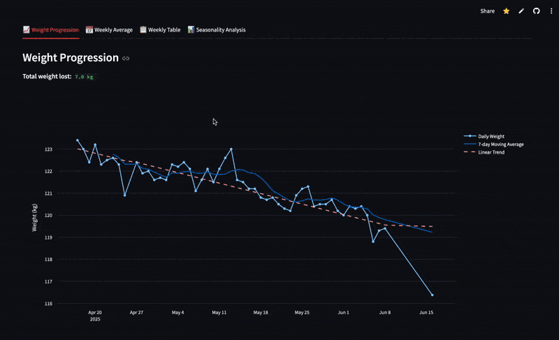

# Personal Weight & Gym Progress Tracker

A multipage Streamlit app for tracking your weight and visualizing your gym progress. Easily upload, edit, and analyze your weight data, and monitor your strength training progress with interactive charts grouped by your own custom workout routine.

## Features

- Upload your weight data as a CSV file
- Add or delete weight entries
- Download your updated CSV file
- Visualize daily and weekly trends with interactive charts
- **NEW:** Customizable gym progress tracker:
  - Upload your own workout routine as a JSON file (define your days and exercises)
  - Upload your FitNotes_Export.csv file (exported from the FitNotes app)
  - Filter your gym progress by any date range
  - View interactive charts for each exercise, grouped by your own routine days, to see how you are progressing and applying progressive overload
  - **Important:** Exercise names in your JSON must match exactly the names in your FitNotes CSV export
- All changes are session-based for privacy (no data is stored on the server)

---

## Demo

### Data Editor

See how easy it is to upload and edit your weight data:

---

### Analysis Page

Visualize your progress and trends:

---

### Gym Progress Tracker

Upload your workout routine and FitNotes CSV to track your gym progress and progressive overload:

---

## Usage

- Go to the **Data Editor** page to upload your CSV and manage your data.
- Use the **Analysis** page to view progress and trends.
- Visit the **Gym Progress Tracker** page to upload your workout plan and FitNotes data, filter by date, and analyze your gym progress.
- After making changes, always download your updated CSV to save your edits.

## License

MIT License

---

**Note:**  
This app does not store your data. Download your CSV after editing to keep your latest records!
